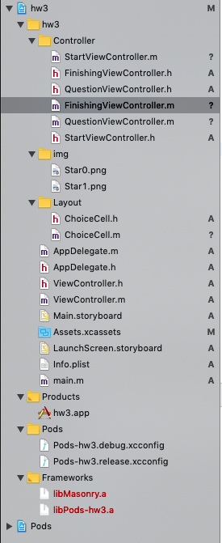
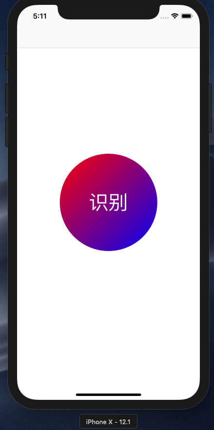
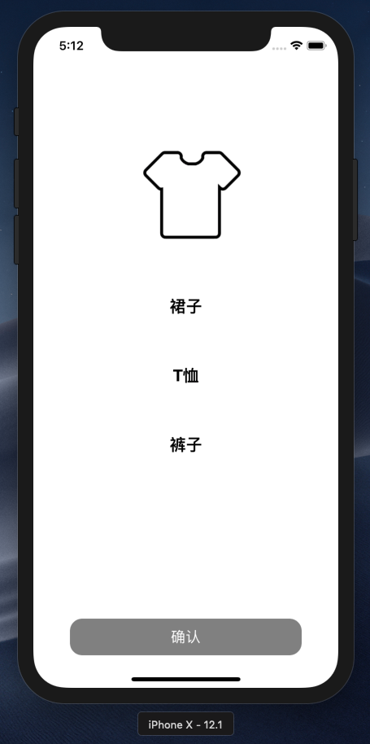
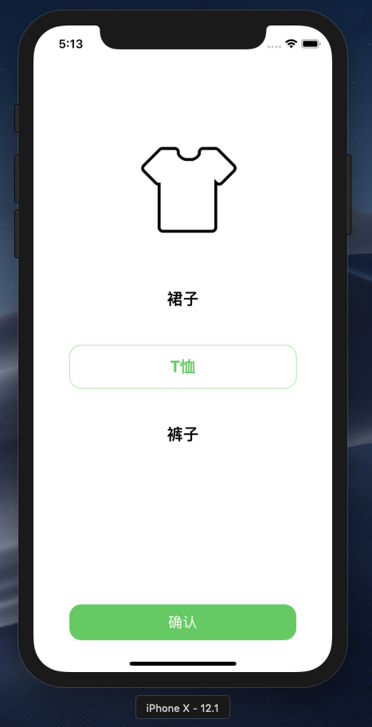
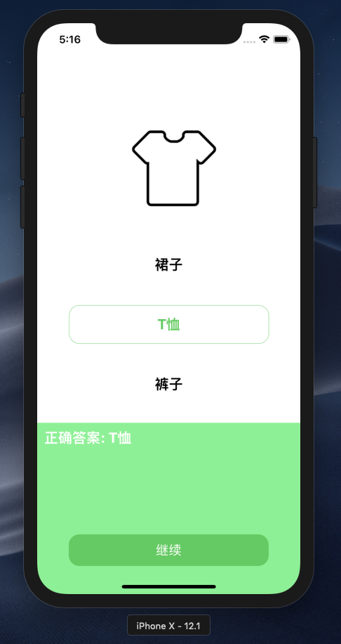
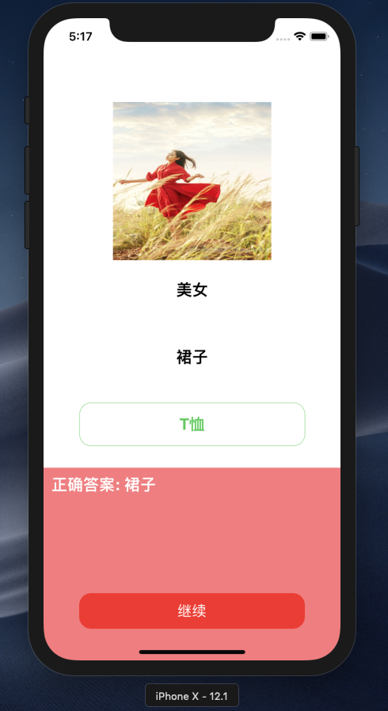
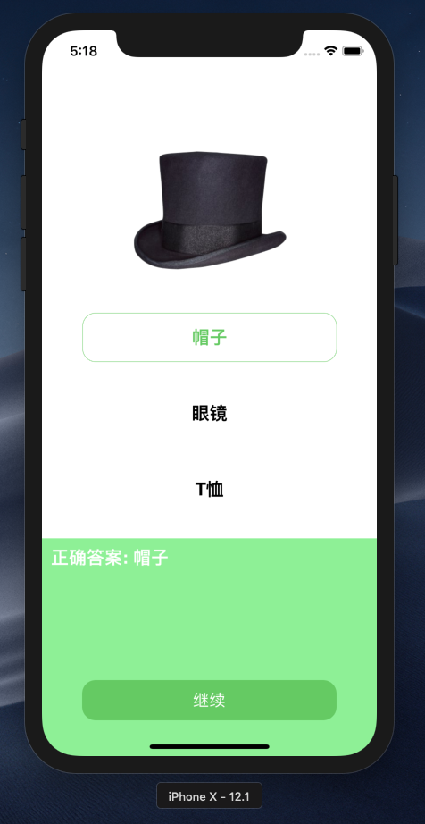
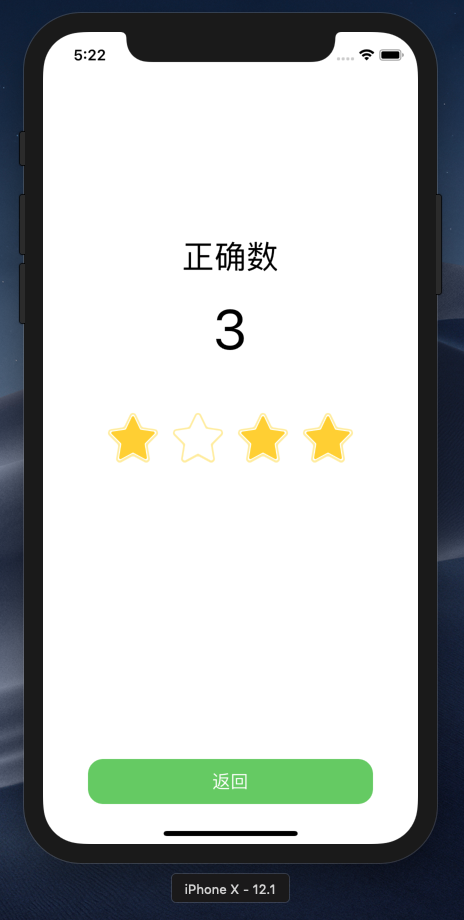

# HW3实验报告
## 介绍
个人作业3 - 网络访问与动画
## 开发环境
+ Mac OS
+ Objective-C
+ Xcode

**注：项目在xcode的iphone X模拟正常，若出现界面布局大小不合适的情况，请更换模拟设备为iphone X**
## 实验目的
+ 学习使用NSURLSession或AFNetworking库进行网络访问
+ 学习使用UIView动画及Core Animation动画
## 项目要求
+ 初始页面是启动后的第一个页面，仅包含一个圆形按钮，文字为“识别”。点击按钮进入答题页面，要求：
    + 各项水平居中，内部文字也水平居中
    + 按钮从左上角到右下角颜色渐变，可参考上表中”初始页面“中按钮的颜色（颜色可自选）。
+ 点击”识别“按钮后，进入选择题界面。该页面每次显示一道题目，各选项垂直排列且水平居中。
    + 页面底部是一个UIButton，当没选中任何选项时，该按钮为灰色，不响应点击。
    + 和上表中”选择题页面“不同的是，所有题目均为图片形式而非文字。
+ 当点击选中任意选项之后，该选项的文字变为绿色，且背景变为绿色的圆角矩形框，底部按钮的背景色也变为绿色。只能同时选中一个选项。
+ 点击底部"确认"按钮后，按钮文字变为"继续"，并且页面底部会弹出一个UIView，弹出动画的持续时间为0.5s。如果选项正确，则弹出的UIView背景色为绿色；若选项不正确，则背景色为红色，同时按钮的颜色也相应地变为红色（UIView的背景色与按钮的背景色需要有区别，建议用RGB值实现）。UIView的左上角显示正确答案。
+ 点击"继续"按钮后，底部UIView向下移动收回，动画持续时间0.5s。然后将页面上显示的题目替换为下一道。
+ 完成所有题目后，点击"继续"，进入分数界面，显示正确题数。
+ 题目信息的获取和选项的判断都需要通过访问网络API实现。该API中的题目四个，每个题目包含一个需要识别的图片URL和四个选项。

加分项:
+ 在分数界面添加四个五角星⭐️图片，并在进入该界面时添加动画。
    + 进入该界面时，分数显示为"0"。各五角星均为空心。
    + 各五角星从左到右依次执行放大缩小的动画，每个五角星的动画持续时间为0.5s
+ 每个五角星对应一道题目，当该题目选择正确时，五角星在动画执行完后变为实心，且分数加1
    + 参考manual中的演示视频
## 项目实现
项目文件结构如下:


### 初始界面(StartViewController)
识别按钮具体实现算法如下,使用Pods/Masonry库设置居中布局,实现了从左上角到右下角颜色渐变
```
// 设置开始识别的按钮
- (void)setupButton {
    //懒加载
    if(self.button == nil){
        // 创建按钮
        self.button = [[UIButton alloc]init];
        self.button.frame = CGRectMake(0, 0, 0, 0);
        self.button.layer.cornerRadius = 100.0;
        // 设置按钮渐变背景（从左上角到右下角）
        CAGradientLayer *gl = [CAGradientLayer layer];
        gl.frame = CGRectMake(0,0,200,200);
        gl.startPoint = CGPointMake(0, 0);
        gl.endPoint = CGPointMake(1, 1);
        gl.cornerRadius = 100;
        gl.locations = @[@0.0, @1.0];
        gl.colors = [NSArray arrayWithObjects:
                     (id)[UIColor redColor].CGColor,
                     (id)[UIColor blueColor].CGColor,
                     nil];
        [self.button.layer addSublayer:gl];
        // 设置内容
        [self.button setTitle:@"识别" forState:UIControlStateNormal];
        [self.button setTitleColor:[UIColor whiteColor] forState:UIControlStateNormal];
        self.button.titleLabel.font = [UIFont systemFontOfSize:40.0];
        // 添加到视图
        [self.view addSubview:self.button];
        [_button mas_makeConstraints:^(MASConstraintMaker *make) {
            make.centerX.equalTo(self.view);
            make.centerY.equalTo(self.view);
            make.size.mas_equalTo(CGSizeMake(200, 200));
        }];
        // 点击后响应事件
        [self.button addTarget:self action:@selector(ButtonClick:) forControlEvents:UIControlEventTouchUpInside];
    }
}
```
### 选择题界面(QuestionViewController)
在显示第一道题目前先通过网络访问获得所有题目数据并存储,使用NSURLSession进行网络访问
```
//从服务器GET数据
-(void) GetAllData{
    // 信号量确保切换页面前，能从网上获取到数据
    sem_get_ = dispatch_semaphore_create(0);
    // 创建一个网络路径
    NSURL *url = [NSURL URLWithString:[NSString stringWithFormat:@"http://172.18.178.56:8360/hw3/get_question"]];
    // 创建一个网络请求
    NSURLRequest *request =[NSURLRequest requestWithURL:url];
    // 获得会话对象
    NSURLSession *session = [NSURLSession sharedSession];
    // 4.根据会话对象，创建一个Task任务：
    NSURLSessionDataTask *sessionDataTask = [session dataTaskWithRequest:request completionHandler:^(NSData * _Nullable data, NSURLResponse * _Nullable response, NSError * _Nullable error) {
        if(error == nil)
        {
            NSDictionary *dic = [NSJSONSerialization JSONObjectWithData:data options:NSJSONReadingMutableContainers error:nil];
            NSDictionary *dataDic = [dic objectForKey:@"data"];
            NSMutableArray *infoList = [dataDic objectForKey:@"info"];
            // 将info中的内容保存到dataInfo中
            [self->_image_url removeAllObjects];
            [self->_choices removeAllObjects];
            [self->_id_ removeAllObjects];
            for (NSMutableDictionary *member in infoList) {
                [self->_image_url addObject:[[member objectForKey:@"image"]description]];
                [self->_choices addObject:[[member objectForKey:@"choice1"]description]];
                [self->_choices addObject:[[member objectForKey:@"choice2"]description]];
                [self->_choices addObject:[[member objectForKey:@"choice3"]description]];
                [self->_id_ addObject:[[member objectForKey:@"id"]description]];
            }
        }
        // 异步获取题目的任务完成，发出信号量
        dispatch_semaphore_signal(sem_get_);
    }];
    // 执行任务（resume也是继续执行）:
    [sessionDataTask resume];
    // 等待同步信号量的到来
    dispatch_semaphore_wait(sem_get_, DISPATCH_TIME_FOREVER);
}
```
将选项提交给服务器并获得结果,使用NSURLSession进行网络访问
```
//将答案POST到服务器
-(BOOL)PostData:(NSString *)answer{
    __block BOOL res = NO;
    // 信号量确保页面刷新前，能从网上获取到数据
    sem_post_ = dispatch_semaphore_create(0);
    // 创建一个网络路径
    NSURL *url = [NSURL URLWithString:[NSString stringWithFormat:@"http://172.18.178.56:8360/hw3/query"]];
    // 创建一个网络请求，分别设置请求方法、请求参数
    NSMutableURLRequest *request =[NSMutableURLRequest requestWithURL:url];
    request.HTTPMethod = @"POST";
    NSDictionary *dic = @{@"number": [NSString stringWithFormat: @"%d", [_id_[_currentQuestion] intValue]],
                          @"choice": answer};
    NSError *error = nil;
    NSData *jsonData = [NSJSONSerialization dataWithJSONObject:dic options:NSJSONWritingPrettyPrinted error:&error];
    NSString *jsonString = [[NSString alloc] initWithData:jsonData encoding:NSUTF8StringEncoding];
    request.HTTPBody = [jsonString dataUsingEncoding:NSUTF8StringEncoding];
    // 获得会话对象
    NSURLSession *session = [NSURLSession sharedSession];
    // 根据会话对象，创建一个Task任务
    NSURLSessionDataTask *sessionDataTask = [session dataTaskWithRequest:request completionHandler:^(NSData * _Nullable data, NSURLResponse * _Nullable response, NSError * _Nullable error) {
        if(error == nil)
        {
            NSDictionary *dict = [NSJSONSerialization JSONObjectWithData:data options:NSJSONReadingMutableContainers error:nil];
            NSDictionary *datadict = [dict objectForKey:@"data"];
            NSString *res_str = [[datadict objectForKey:@"res"]description];
            if ([res_str isEqualToString:@"true"]) {
                res = YES;
            }
            else {
                res = NO;
            }
            
        }
        dispatch_semaphore_signal(sem_post_);
    }];
    // 执行任务，(resume也是继续执行)。
    [sessionDataTask resume];
    dispatch_semaphore_wait(sem_post_, DISPATCH_TIME_FOREVER);
    return res;
}
```
初始化图片视图组件算法如下:
```
//初始化图片视图组件
- (void)initImage {
    _imageview = [[UIImageView alloc]init];
    NSString *string=self->_image_url[_currentQuestion];
    NSURL *url = [NSURL URLWithString:string];
    NSData *data=[NSData dataWithContentsOfURL:url];
    _imageview.image = [UIImage imageWithData:data];
    [self.view addSubview:_imageview];
    [_imageview mas_makeConstraints:^(MASConstraintMaker *make) {
        make.width.mas_equalTo(200);
        make.height.mas_equalTo(200);
        make.centerY.equalTo(self.view).offset(-200);
        make.centerX.equalTo(self.view);
    }];
}
```
创建layout布局类,设置选项垂直流布局
```
-(void)CreateCol{
    //创建一个layout布局类
    UICollectionViewFlowLayout * layout = [[UICollectionViewFlowLayout alloc]init];
    //设置布局方向为垂直流布局
    layout.scrollDirection = UICollectionViewScrollDirectionVertical;
    //设置每个item的大小
    layout.itemSize = CGSizeMake(285, 55);
    //创建collectionView 通过一个布局策略layout来创建
    self.collectionView = [[UICollectionView alloc]initWithFrame:self.view.frame collectionViewLayout:layout];
    //注册collectionViewCell
    //注意，此处的ReuseIdentifier 必须和 cellForItemAtIndexPath 方法中 一致 均为 cellId
    [self.collectionView registerClass:[ChoiceCell class] forCellWithReuseIdentifier:@"cellId"];
    self.collectionView.backgroundColor = [UIColor clearColor];
}
```
在点击确定按钮后提交答案,根据接收到的结果判断选项是否正确.如果选项正确，则弹出的UIView背景色为绿色；若选项不正确，则背景色为红色，同时按钮的颜色也相应地变为红色,用RGB值实现UIView的背景色与按钮的背景色实现有区别，UIView的左上角显示正确答案。
```
//点击“确定”按钮的事件
-(void)Confirm{
    if(_ConfirmBtn.tag == 1){
        _isConfirm = YES;
        [_ConfirmBtn setHidden:YES];
        [_GoOnBtn setHidden:NO];
        [self updateCorrectAnswer];
        _displayAnswer.text = [NSString stringWithFormat:@"正确答案: %@", _correct];
        if([self PostData:_answer]){
            [_display setBackgroundColor:[UIColor colorWithRed:144.0/255.0 green:238.0/255.0 blue:144.0/255.0 alpha:1.0]];
            _FVC.totalRight[_currentQuestion]=@"right";
        }
        else{
            [_GoOnBtn setBackgroundColor:[UIColor colorWithRed:233.0/255.0 green:63.0/255.0 blue:51.0/255.0 alpha:1.0]];
            [_display setBackgroundColor:[UIColor colorWithRed:237.0/255.0 green:127.0/255.0 blue:128.0/255.0 alpha:1.0]];
            _FVC.totalRight[_currentQuestion]=@"wrong";
            
        }
        [UIView animateWithDuration:0.5 delay:0 options:UIViewAnimationOptionBeginFromCurrentState animations:^ {
            CGRect screenBounds = [[UIScreen mainScreen] bounds];
            self->_display.transform = CGAffineTransformTranslate(self->_display.transform, 0, -screenBounds.size.height * 0.3);
        } completion:^(BOOL finished) {
            
        }];
    }
}
```
### 分数界面(FinishingViewController)
使用UILabel组件显示题目正确数,具体实现算法如下:
```
-(void)CreateTxt{
    _displayNum = [[UILabel alloc]init];
    [_displayNum setText: [NSString stringWithFormat:@"%d", _correctNum]];
    [_displayNum setFont: [UIFont systemFontOfSize: 56]];
    [_displayNum setTextColor: [UIColor blackColor]];
    [_displayNum setTextAlignment:NSTextAlignmentCenter];
    [_displayNum setContentCompressionResistancePriority:UILayoutPriorityRequired forAxis:UILayoutConstraintAxisHorizontal];
    [self.view addSubview:_displayNum];
    [_displayNum mas_makeConstraints:^(MASConstraintMaker *make) {
        make.centerX.equalTo(self.view);
        make.bottom.equalTo(self->_NO1.mas_top).offset(-50);
    }];
    
    _correctTxt = [[UILabel alloc]init];
    [_correctTxt setText: @"正确数"];
    [_correctTxt setFont: [UIFont systemFontOfSize: 32]];
    [_correctTxt setTextColor: [UIColor blackColor]];
    [_correctTxt setTextAlignment:NSTextAlignmentCenter];
    [_correctTxt setContentCompressionResistancePriority:UILayoutPriorityRequired forAxis:UILayoutConstraintAxisHorizontal];
    [self.view addSubview:_correctTxt];
    [_correctTxt mas_makeConstraints:^(MASConstraintMaker *make) {
        make.centerX.equalTo(self.view);
        make.bottom.equalTo(self->_displayNum.mas_top).offset(-20);
    }];
}
```
使用关键帧动画实现各五角星从左到右依次执行放大缩小的动画，每个五角星的动画持续时间为0.5s,每个五角星对应一道题目，当该题目选择正确时，五角星在动画执行完后变为实心，且分数加1,具体实现算法如下:
```
-(void)BeginAnimation{
    for(int i = 0; i < [_Stars count]; i ++){
        [UIView animateKeyframesWithDuration:1 delay:0.5 +i options:UIViewKeyframeAnimationOptionCalculationModeLinear animations:^{
            [UIView addKeyframeWithRelativeStartTime:0 relativeDuration:0.5 animations: ^{
                // key frame 0
                ((UIImageView*)self->_Stars[i]).transform = CGAffineTransformMakeScale(2, 2);
            }];
            [UIView addKeyframeWithRelativeStartTime:0.5 relativeDuration:0.5 animations: ^{
                // key frame 1
                ((UIImageView*)self->_Stars[i]).transform = CGAffineTransformMakeScale(1, 1);
            }];
        } completion:^(BOOL finished) {
            if( [self->_totalRight[i] isEqual:@"right"]){
                [(UIImageView*)self->_Stars[i] setImage:[UIImage imageNamed:@"Star1.png"]];
                self->_correctNum ++;
                [self->_displayNum setText:[NSString stringWithFormat:@"%d", self->_correctNum]];
            }
        }];
    }
}
```
## 效果展示
编译运行,初始界面如下:



点击识别按钮进入选择题界面:



点击一个选项:



点击确认按钮,答案正确时界面如下:



点击确认按钮,答案错误时界面如下:



第三题选择正确选项并确认:


第四题选择正确选项并确认:



点击继续进入分数界面查看正确题数:

